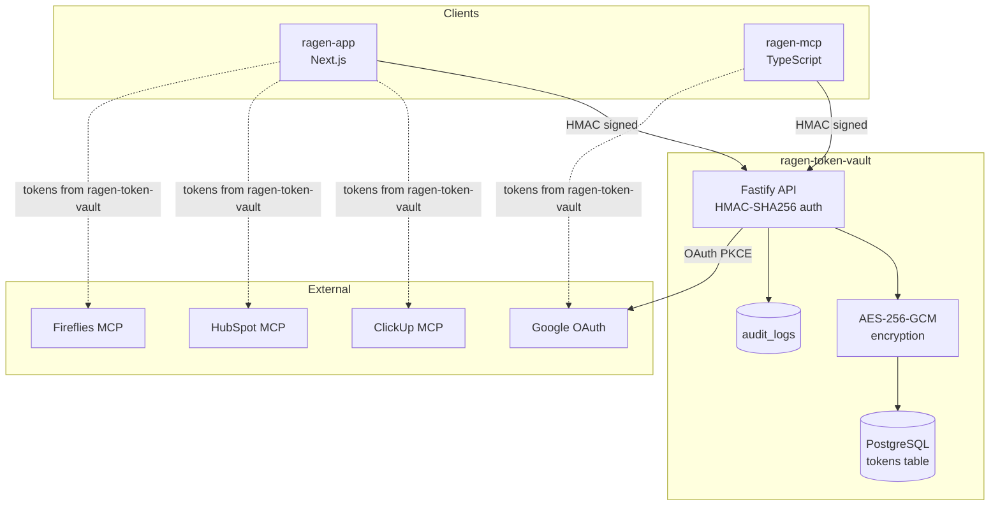
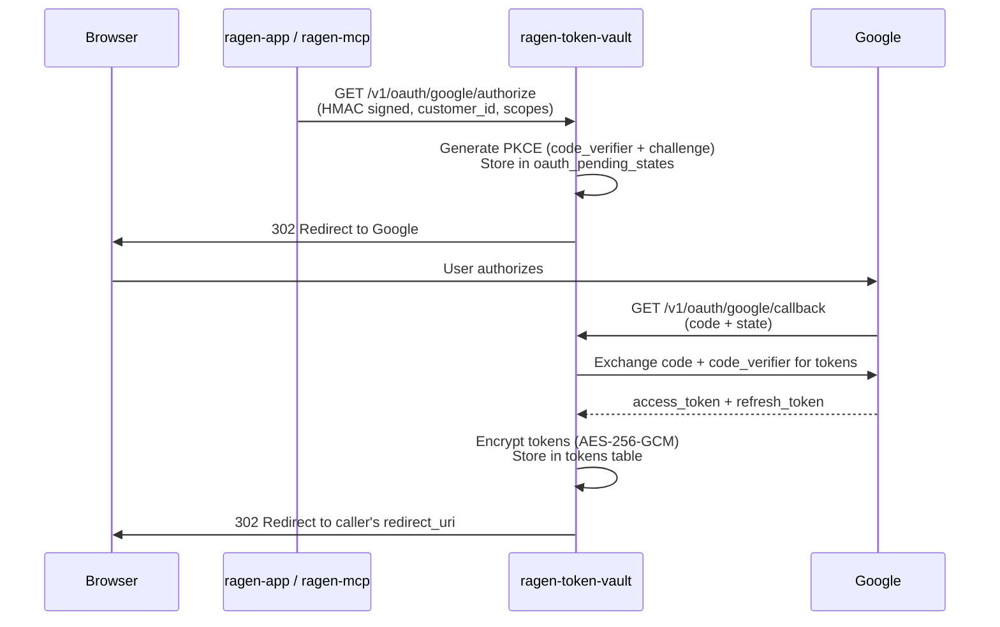

# ragen-token-vault

Centralized Token Vault Service for the ragen ecosystem. Stores all customer OAuth tokens and API keys with AES-256-GCM encryption, so other services (ragen-app, ragen-mcp) become stateless regarding secrets.

## Stack

- **Runtime**: Node.js 22 + TypeScript 5.7
- **Framework**: Fastify 5
- **Database**: PostgreSQL 16 + Prisma 7
- **Encryption**: AES-256-GCM (Node.js `crypto`)
- **Auth**: HMAC-SHA256 service-to-service authentication
- **Observability**: OpenTelemetry (traces, metrics, logs) + Pino logger
- **Deployment**: Docker + Railway

## Quick Start

```bash
# Start local Postgres
docker compose up -d

# Install dependencies
npm install

# Generate Prisma client
npx prisma generate

# Run migrations
cp .env.example .env.local
npx prisma migrate dev

# Start dev server
npm run dev
```

The server runs on `http://localhost:3100` by default.

## Environment Variables

| Variable | Required | Description |
|----------|----------|-------------|
| `DATABASE_URL` | Yes | PostgreSQL connection string |
| `ENCRYPTION_KEY` | Yes | 64-char hex string (32 bytes for AES-256) |
| `RAGEN_TOKEN_VAULT_SERVICE_SECRET` | Yes | Shared secret for HMAC service auth (min 32 chars) |
| `GOOGLE_CLIENT_ID` | No | Google OAuth client ID |
| `GOOGLE_CLIENT_SECRET` | No | Google OAuth client secret |
| `GOOGLE_REDIRECT_URI` | No | Google OAuth callback URL (default: `http://localhost:3100/v1/oauth/google/callback`) |
| `PORT` | No | Server port (default: `3100`) |
| `HOST` | No | Server host (default: `0.0.0.0`) |
| `NODE_ENV` | No | `development`, `production`, or `test` |
| `OTEL_EXPORTER_OTLP_ENDPOINT` | No | OTLP collector endpoint for traces/metrics/logs |
| `TARGET_ENV` | No | Deployment environment name (default: `local`) |
| `GIT_COMMIT_SHA` | No | Git commit SHA for service version |

Generate `ENCRYPTION_KEY` and `RAGEN_TOKEN_VAULT_SERVICE_SECRET`:
```bash
node -e "console.log(require('crypto').randomBytes(32).toString('hex'))"
```
Run it twice — once for each variable.

## Architecture

ragen-token-vault is the central token vault for the ragen ecosystem. All services store and retrieve tokens through it.



### Google OAuth Flow (PKCE)



## API Endpoints

All endpoints (except health and OAuth callback) require HMAC-SHA256 authentication via the `Authorization` header:
```
Authorization: HMAC-SHA256 ts={unix_timestamp},sig={hex_signature}
```

Signature is computed as: `HMAC(secret, "{timestamp}\n{method}\n{path}\n{body_sha256}")`

Include `X-Service-Name` header for audit logging (e.g., `ragen-app`, `ragen-mcp`).

### Token CRUD

| Method | Path | Description |
|--------|------|-------------|
| `PUT` | `/v1/tokens/:customerId/:provider` | Store/update encrypted token |
| `GET` | `/v1/tokens/:customerId/:provider` | Retrieve decrypted token |
| `DELETE` | `/v1/tokens/:customerId/:provider` | Delete token |
| `GET` | `/v1/tokens/:customerId/:provider/status` | Check auth status (no secrets) |
| `GET` | `/v1/tokens/:customerId` | List all providers for customer (metadata only) |

### Google OAuth

| Method | Path | Auth | Description |
|--------|------|------|-------------|
| `GET` | `/v1/oauth/google/authorize` | HMAC | Start OAuth + PKCE flow |
| `GET` | `/v1/oauth/google/callback` | None | Google redirect callback |
| `POST` | `/v1/oauth/google/refresh` | HMAC | Force-refresh access token |

### Health

| Method | Path | Auth | Description |
|--------|------|------|-------------|
| `GET` | `/health` | None | Health check (DB connectivity) |

## Database

Three tables: `tokens`, `oauth_pending_states`, `audit_logs`.

- `tokens` — Encrypted token storage with unique constraint on `(customer_id, provider)`
- `oauth_pending_states` — Temporary PKCE state during OAuth flows (10-min TTL)
- `audit_logs` — Immutable log of all token operations

## Encryption

- Algorithm: AES-256-GCM
- IV: 12 bytes, randomly generated per encryption
- Storage format: `{iv_hex}:{ciphertext_b64}:{auth_tag_hex}`
- Encrypted fields: `access_token`, `refresh_token`, `client_id`, `client_secret`, `code_verifier`

## Observability

When `OTEL_EXPORTER_OTLP_ENDPOINT` is set, the service exports:
- **Traces** via `BatchSpanProcessor` (HTTP and PostgreSQL auto-instrumented)
- **Metrics** via `PeriodicExportingMetricReader` (30s interval)
- **Logs** via `BatchLogRecordProcessor` (Pino logs bridged to OTEL)

## Scripts

```bash
npm run dev            # Start with hot reload (tsx watch)
npm run build          # Prisma generate + tsc
npm run start          # Run production build
npm run test           # Run tests (vitest watch)
npm run test:run       # Run tests once
npm run test:coverage  # Run tests with v8 coverage report
npm run generate:types # Regenerate Prisma client
npm run db:migrate     # Deploy migrations
npm run db:migrate:dev # Create/apply dev migrations
```
